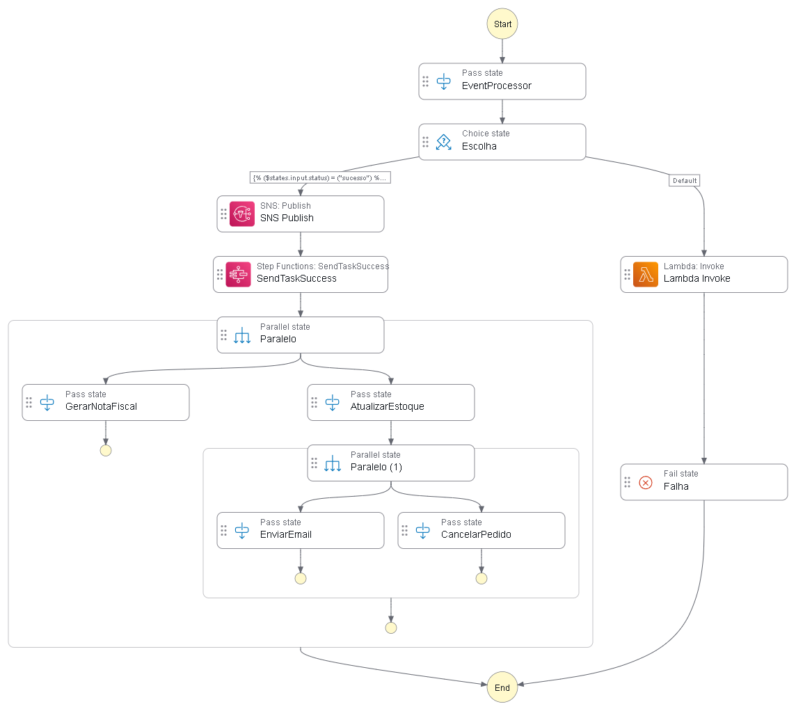

# aws-stepfunctions-orderflow
# AWS Step Functions: Orquestrador de Pedidos

Projeto desenvolvido para orquestração de fluxos de trabalho serverless utilizando AWS Step Functions.

## ⚙️ Tecnologias
- AWS Step Functions (Estados de Escolha, Passagem e Êxito)
- Lógica de decisão via JSONata
- Arquitetura Serverless

## 🖼️ Visualização do Fluxo

## 🎯 Status do Projeto
Projeto validado com sucesso. O fluxo processa entradas de status, realiza a tomada de decisão condicional e finaliza com êxito em todos os caminhos configurados.
